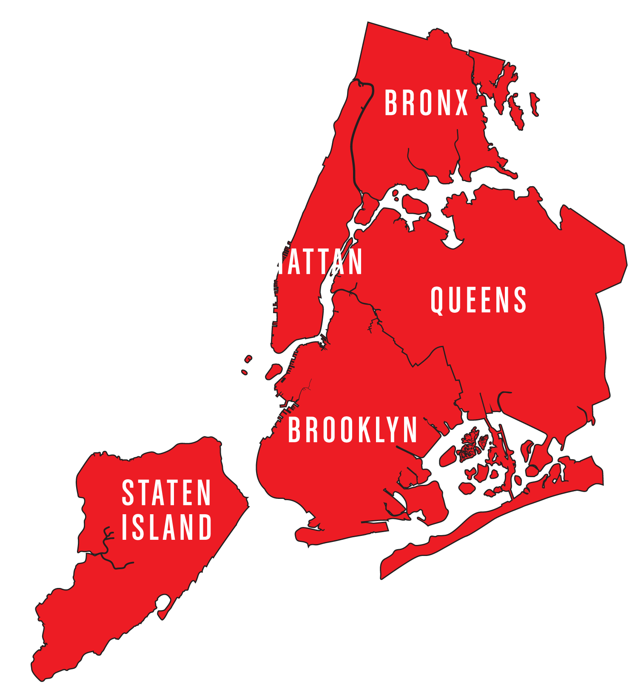

# NYC Jobs 22

https://nycjobs.dcartist.studio

Helping those in need of jobs and financial aid in the New York City Area, using data and api from NYC Open Data. This was built within a week for the Developer Week Hackathon. (https://www.developerweek.com/events/hackathon/)

## Installation Instructions

- Clone and download the project
- cd into the project 
- use `npm install` to install the react app
- use `npm run start` to start the project

## Technologies Used

- Node
- React Js
- React Bootstrap
- CSS3 Animation Cheat Sheet
- Mapbox (mapbox-gl)
- React animation on scroll
- axios
- React-icons
- React-parallax
- Vercel
